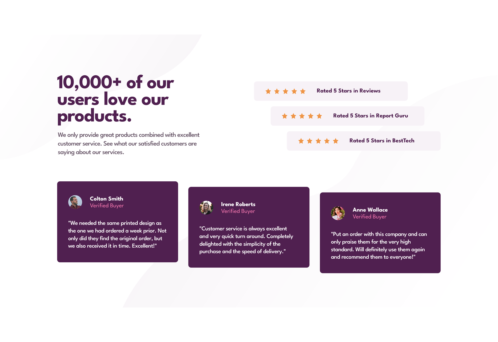

# Frontend Mentor - Social proof section solution

This is a solution to the [Social proof section challenge on Frontend Mentor](https://www.frontendmentor.io/challenges/social-proof-section-6e0qTv_bA). Frontend Mentor challenges help you improve your coding skills by building realistic projects. 

## Table of contents

- [Overview](#overview)
  - [Screenshot](#screenshot)
  - [Links](#links)
- [My process](#my-process)
  - [Built with](#built-with)
- [Author](#author)
- [License](#License)

## Overview

### Screenshot

### Links

- [Solution](https://www.frontendmentor.io/solutions/)
- [Live Site](https://docforloop.github.io/)

## My process

### Built with

- Semantic HTML5 markup
- CSS custom properties
- Flexbox
- Mobile-first workflow
- [Sass](https://sass-lang.com/) (SCSS for maintainable and modular styles)
- [Vite](https://vite.dev/) - Build tool for modern web development

## Author

- Frontend Mentor - [@DocForLoop](https://www.frontendmentor.io/profile/DocForLoop)

## License

This project is licensed under the MIT License - see the [LICENSE](./LICENSE) file for details.